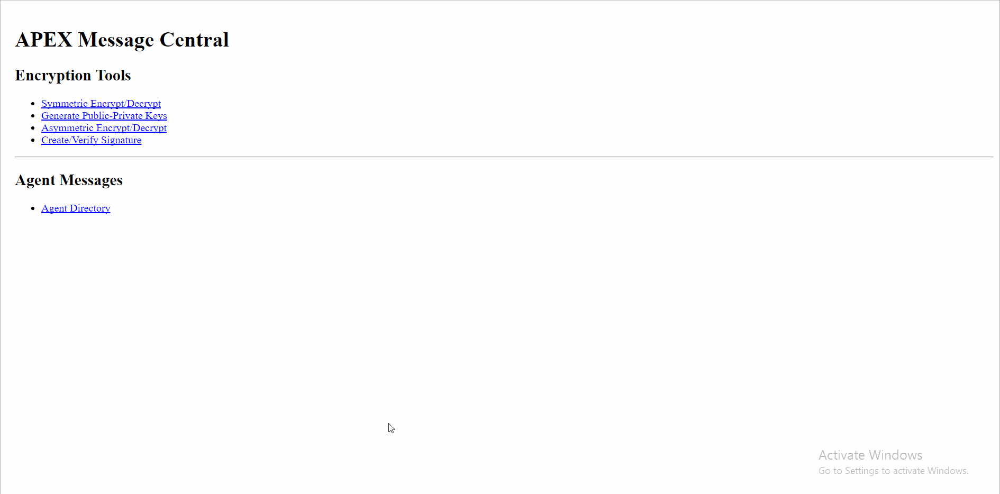

# Project 5 - Encryption

Time spent: 6 hours spent in total

## User Stories

The following **required** functionality is completed:

1\. Symmetric Encrypt/Decrypt
  * [X]  Required: Repair the symmetric encrypt and decrypt code

2\. Encrypted Message 1
  * [ ]  Required: Decrypt the government message
        Decrypted Message:
  * [ ]  Required: Encrypt a response and include in this README

3\. Generate Public-Private Keys
  * [X]  Required: Repair the key generator code
  * [X]  Required: Generate keys for "johnsteed" and add him to the Agent Directory

4\. Asymmetric Encrypt/Decrypt
  * [X]  Required: Repair the asymmetric encrypt and decrypt code

5\. Create/Verify Signature
  * [X]  Required: Repair the create and verify signature code
  
6\. Encrypted Message 2
  * [X]  Required: Decrypt the message
        Decrypted Message: Cannot access APEX from this location. Send new agent codename and public key so I can contact. Encrypt response to protect codename. Include signature to verify identity and message integrity. -- sydneybristow
  * [X]  Required: Verify the message
  * [X]  Required: Include a response message in this README
        To: sydneybristow
        From: agent99
        Subject: Encrypted and Signed Response
        Body:
         odIMcXdO9telkr3tH+8nubHRf1bp5G2LosduysAbH+oPr9OZ0EOH4QtCpoxElqoCEKZSZi9yFNm84HNwe4pYfflFZQdqu22gKVkUMCPx9+QRlA1cwP/HjJfeyD8KuWOD/Lobm5DJRd7y4IM4yBlWa4MB6GQS1EJVFqsDJ/HTmZAnB5zNEhBSPOuJ5AlqBJeCa2h4qCcTaYxU/KtezDq28U48xOk7tBOrsteFFgS3bbypdoth6LDGAz6TzlTHNqdwq5km7rAAb1cryxxbSP4DvQE0uunKPRjx8F6/jrXMPYlznrypJwUoGETbUZzJLhSFniOJmdfa5Tdjd4vZnMoAKw== GQjTc48Im7MRCU5Pf19qndTZP/OhmG5k12R96Zr2ugPa6BXxY/zkG65sGxgozH7c/3cJ5vvpx7bt+AdcLWfXVBjpHk3os4axpy/3tpCzDE5VD+q3fMrrHzt/9DSrStE+gy4vfrGIXKhSeH4LfNMcfCOZ18Z+jveakytGIgtwByJRmHT1V8moMJCu2SZD+goGg3hGwEL50K8wiCfHHiNr5N0JLUfhEdeD+NPpSsHU5kwZpXlKNS0MQ04nVftYOj8ee5o1t3odeSXfPQT8q0K67LNfH/CG5Du5P4YNd68ArMeTMMM80zUBjheMZxUZSYd47A8W2/sVpxjy152wEMHmlw== lzj62yd9mhyiwyz3jk7flQ2CObCAXJ2Pd8g9pJxRUfIvaVh0un2Fxcwew2QjdgzTzQNii0JARXEMQkzIsaGEP9aEtwojjf8K1hrumcMilj08tegB5pcn4iWkRZJz3Mc58iW/2QCvMus4x9vw1QugEpd0TM+V8VcGoQnjLW/L16U4b0SZxCrKToq4LBB7K8BQpFOAU7L6ha9dlKGHWMtW24O+MtyrIXJSOM6e/+aq7rU0toYqgrYTJEbyf1BedYnMdJyDcc6kK+6j8JwgIWpll9OevfuTQPvtZth531I3pgJHgTHv8mtnb2JYGZ9ZFi3ZNCBabK0uA/vhUDbCgWswVQ==
        
        Signature: P6eNSTfZHlK8AaEN/Ddzpjm0IGZnFgY9YWjhK8PZ8Hx/fPG7IQfAInqOXu2l8+qLN9GWMeOWbSjv96WFWeysXKpgeuNLKYsNFZD0YPjb2nJzqtvi3dQnAt6kD4luBLXRyIBKRqfsiQSppyjZJ7B5jr2kkEjMYUKQ6PkgMAOJEjZ91Kjk4qZN/G+4Rx5umFdoyTh+g/4oGuMIXFY5XVGy1KV58S0LOEWaRwb8gG3L3zVKqsWPzsx32LplRK97NaRAVWBp2V2CnurJuzQ9jkl2euXmJiSBOAJRJNbvgEWe9Ms6gF4jrl3JHjhA2Jz+OmZGRaiul3dkpcw+yq/KyRAOYg== HoPmSyffPDIMIdoaG0usOpezqgTPEHdOq2uQ8Xk6lbZuZxvz5cSO+dh1ROLO199ipZ0FXty4sAO5k0IunSW++vtqBCpkVl8M4uTNda8D8dGAIJvtltzTFT6XQXFjcxIA2MbFBggzULQjdIBK3t5CJ9mWiMbpCTqI6kxT9PalEzHAvU3JwCbui1dsbKIL9iPo/KxkLPZ1AJDDIgxFXRhEgo5G9+zXhxR5gBvhJhhv1Kza7TkTwoX5qvNgHCON9aeob6qqkKSV2Q4bM8xOFhymQgGcLNGMmE0MjdINATJ1+jw2hacHzNblOGtwwYHFpX3jqlNlF9VGeo921luDSl2MtQ== xKNXe9ucWLFMKhJAYcV4dcUBD1IWq741C2JWwM+b2RP7ePKWRiv346tzFLnauD0PoQfHS0/mWXvRSpaYIrgX9REPj69GEupuPL7GNl7jw1IdJdAyYkp8z0pTJGBUyAoQywWLfIaTg0MTJvra4z4ecY+L3Ce4GLP2fAtgRONMKGQ0TiiqGmhxzXSWpMEMrc/wBFaseUmNLurzRUTtHd4XYIXSSPL8bgJHr/MI6rfsp8cZhbBq4r3qc5yPkusEgq3vHlhxOTnIXnJvc5qrYg+yZ5KEmkM/kgNkj3h7ZFgmE+vLA7r99sdNTgNhbsn57xhNkIgYjgQ+eBleDkDymwjQ8Q==

7\. Agent Messages
  * [X]  Required: Repair the dropbox code
  * [X]  Required: Repair the messages area
  * [X]  Required: Display encrypted messages for all agents
  * [X]  Required: Messages indicate whether the message signature is valid
  * [X]  Required: Your messages are automatically decrypted

8\. Identify the Double Agent
  * [ ]  Required: Decrypt as many email messages as possible
  * [ ]  Required: Identify the double agent: ____________________

The following objectives are **optional**:

* Bonus Objective 1\.
  * [X]  Track down the bugs in the code and fix them.
        1 SQL bug found in function find_agent_by_id() in query_functions.php (Escape Strings)
        6 XSS bugs found in symmetric_encryption.php (Sanatize Output)

* Bonus Objective 2\.
  * [ ]  Write a report of your discoveries (longer than 300 characters).
  * [ ]  Compose a secure email for sending over an insecure network.
  * [ ]  Include the email with your encrypted report in this README.

* Bonus Objective 3\.
  * [ ]  Add a "Create/Verify Checksum" section to the Encryption Tools area.

* Advanced Objective 1\.
  * [X]  Add support for other symmetric algorithms.
        Support for AES-256-CBC, AES-128-CBC, AES-192-CBC, DES-EDE3-CBC

## Video Walkthrough

Here's a walkthrough of implemented user stories:

GIF created with [LiceCap](http://www.cockos.com/licecap/).

## Notes

Describe any challenges encountered while building the app.

## License

    Copyright [2017] [Matthew Blumen]

    Licensed under the Apache License, Version 2.0 (the "License");
    you may not use this file except in compliance with the License.
    You may obtain a copy of the License at

        http://www.apache.org/licenses/LICENSE-2.0

    Unless required by applicable law or agreed to in writing, software
    distributed under the License is distributed on an "AS IS" BASIS,
    WITHOUT WARRANTIES OR CONDITIONS OF ANY KIND, either express or implied.
    See the License for the specific language governing permissions and
    limitations under the License.
